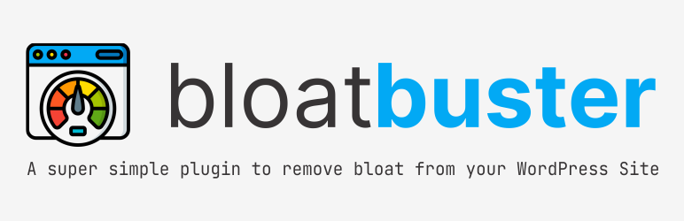

  
  

Bloat Buster is a super simple plugin to remove unnecessary bloat from your WordPress site. Just a toggle away and you're set.

## Features

### 9 Optimization Features Available:

- **Remove Emoticon Scripts** - Remove extra code related to emojis from WordPress which was added recently to suport emoticons in an older browser.

- **Remove Full Site Editing Global Styles** - This will prevent the Full Site Editing global CSS from loading because this script is enabled by default even if you're not using FSE.

- **Remove RSD Links** - RSD (Really Simple Discovery) is needed if you intend to use XML-RPC client, pingback, etc. However, if you don’t need pingback or remote client to manage post then you can safely get rid of this unnecessary header.

- **Remove Shortlink** - Starting from version 3, WordPress added shortlink (shorter link of web page address) in header code. If you're not using shortlink for any functionality then you can remove them.

- **Disable Embed** - WordPress introduced oEmbed features in 4.4 which allows any site to embed WordPress post remotely. Activate this feature to prevent other parties from embedding your blog post and disable loading related JS file.

- **Disable XML-RPC** - Activate this option if you don't use WordPress API (XML-RPC) to publish/edit/delete a post, edit/list comments, upload file. Having XML-RPC enabled and not hardened properly may lead to DDoS & brute force attacks.

- **Hide WordPress Version** - This doesn’t help in performance but more to mitigate information leakage vulnerability. By default, WordPress adds meta name generator with the version details which is visible in source code and HTTP header. To remove the WP version, activate this option.

- **Disable Heartbeat** - WordPress use heartbeat API to communicate with a browser to a server by frequently calling admin-ajax.php. This may slow down the overall page load time and increase CPU utilization if on shared hosting. If you don’t have a requirement to use heartbeat API, then you can activate this option.

- **Disable Dashicons on The Front-end** - Dashicons are utilized in the admin console, and if not using them to load any icons on front-end then you may want to disable it. By activating this option, <code>dashicons.min.css</code> will stop loading on front-end.

